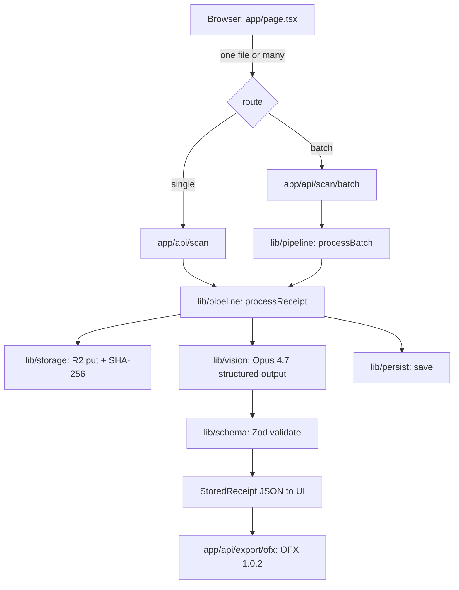

# Architecture

Single-process Next.js application. There is no separate worker, queue, or
database in the default build. The whole pipeline runs server-side, which keeps
the API key off the client and makes the cost surface easy to reason about.

## Request flow

The steps, in order:

1. **Upload.** `app/page.tsx` posts one or more files as multipart form data. One file goes to `/api/scan`, several go to `/api/scan/batch`. The browser never holds an API key.
2. **Store the original.** `lib/storage.ts` writes the image to Cloudflare R2, content-addressed by SHA-256, and returns the key plus hash. When R2 is not configured this is a no-op that still computes the hash, so deduplication and audit hashing work either way.
3. **Pre-process.** `sharp` corrects EXIF orientation, downscales the long edge to `MAX_IMAGE_PX` (default 2576, matching Opus 4.7 high-resolution vision), and re-encodes to JPEG. This is the biggest cost lever.
4. **Vision call.** `lib/vision.ts` sends the base64 image to Claude Opus 4.7 with the receipt JSON Schema as a structured-output constraint and a cached system prompt. The model returns valid JSON in the exact shape.
5. **Validate.** The text is parsed and run through the Zod schema in `lib/schema.ts`. Because the model was already constrained, this is a boundary, not a repair step; a malformed response still cannot reach a database or the UI.
6. **Persist and respond.** `lib/persist.ts` (a no-op stub by default) returns a complete `StoredReceipt` with id, image key, hash, and timestamp. The UI renders it as a table and can export the set to OFX.

## Why a strict schema boundary

The schema is the contract. Structured outputs constrain the model to emit it,
and Zod re-validates on the way in. This is why moving the vision call to a
different provider requires no changes outside `lib/vision.ts`: the rest of the
app only ever sees a validated `Receipt`.

The JSON Schema handed to the model in `lib/vision.ts` is written by hand rather
than derived from the Zod schema, because the SDK's Zod-to-JSON-Schema helper
requires Zod 4 and the project pins Zod 3. The two must be kept in sync; a field
added to one must be added to the other. See the Zod 4 tracking issue.

## Component map

| File | Responsibility |
|---|---|
| `app/page.tsx` | Upload UI, parsed tables, OFX export trigger |
| `app/api/scan/route.ts` | Single-scan endpoint |
| `app/api/scan/batch/route.ts` | Batch endpoint, up to 50 files, per-file results |
| `app/api/export/ofx/route.ts` | OFX 1.0.2 statement download |
| `lib/pipeline.ts` | The one path: store, scan, persist; batch fan-out |
| `lib/vision.ts` | The single vision call. Opus 4.7, structured output, caching |
| `lib/schema.ts` | The Zod contract and the `StoredReceipt` type |
| `lib/storage.ts` | Optional Cloudflare R2 original-image storage |
| `lib/ofx.ts` | OFX 1.0.2 generation |
| `lib/persist.ts` | `save()` stub. Replace with your backend |
| `docs/schema.sql` | Postgres / Supabase tables that mirror the contract |

## Batch concurrency

`processBatch` runs a small pool of workers (default four) over the uploaded
files. Each file is independent: a failure is captured as a per-file error
rather than failing the request, so one unreadable image never sinks the batch.
Bounded concurrency keeps the model bill and memory predictable.

## Failure modes

- **Image too dark or blurry:** the model returns mostly nulls. Flag low confidence in the UI when most fields are null.
- **Unsupported currency symbol:** the system prompt maps the common symbols to ISO codes; anything else lands as raw text to normalise downstream.
- **Hand-written receipts:** hit and miss. Vision reads printed receipts well, scribbled tips less well.
- **Vision API rate limit:** returns 429. The SDK retries with backoff; add more if you serve many users concurrently.

## Cost reference

A typical phone photo of a UK till receipt at 2576px is one vision request plus
a small JSON output. Downscaling in step 3 is what keeps it cheap; the cached
system prompt trims input cost on repeat scans. Higher-resolution input on Opus
4.7 buys accuracy on small tax-breakdown print at a higher per-image token cost,
so tune `MAX_IMAGE_PX` to your receipts.

## Deployment topology

Vercel ships `sharp` on the Node runtime, which the scan routes pin. R2 is
reached over HTTPS with the S3 client. No build configuration is needed beyond
the environment variables.
