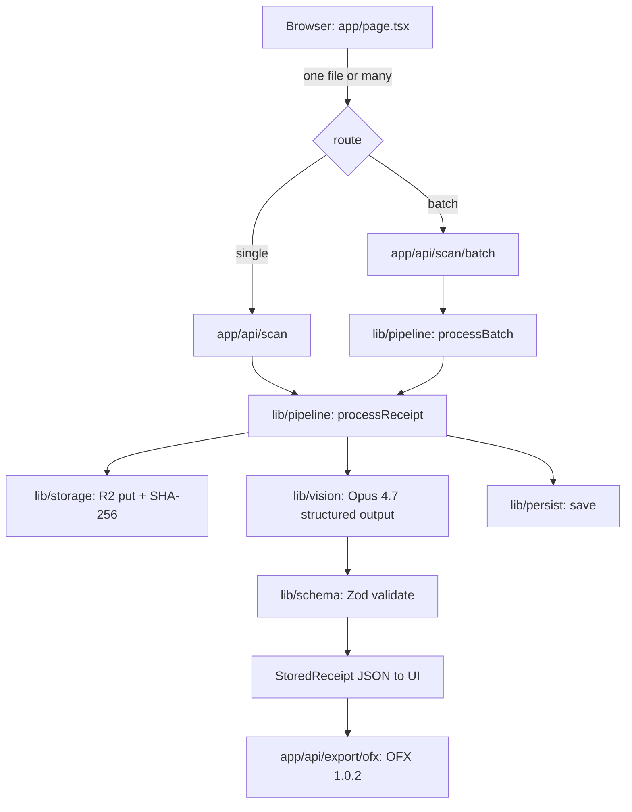

# Receipt Scanner

[](https://github.com/sarmakska/receipt-scanner/blob/main/LICENSE)
[](https://github.com/sarmakska/receipt-scanner)
[](https://github.com/sarmakska/receipt-scanner/commits/main)
[](https://nextjs.org)
[](https://typescriptlang.org)

**Photograph a receipt, get structured JSON, export to your accounting tool.**

Receipt Scanner is a working Next.js starter that turns a photo of a receipt into validated, structured data using a high-resolution vision model. The model is constrained to a strict schema, so the output is valid JSON in the exact shape every time rather than free-form text I have to repair. Fork it, point it at your storage and accounting backend, and ship.

Built by [Sarma Linux](https://sarmalinux.com).

---

## What this is

You upload one receipt or fifty. Each image is downscaled and re-encoded for cost, sent to Claude Opus 4.7 with the receipt schema as a structured-output constraint, validated against a Zod contract, and returned to the UI as a table. From there you can store the originals on Cloudflare R2, export to OFX for your accounting tool, or wire the JSON into Supabase, Xero, QuickBooks, or n8n.

It extracts:

- vendor name and address
- transaction date and time
- itemised line items with quantity, description, unit price, line total
- subtotal, tax, tip, total
- currency (ISO 4217)
- payment method when visible

## When to use this, when not to

Use this when:

- You want a working receipt-to-JSON pipeline you can fork and ship, not a tutorial.
- You are building an expense, bookkeeping, or finance product and need a proven OCR baseline.
- You want a strict schema boundary so malformed model output never reaches your database.
- You need batch processing and an accounting-tool export (OFX) out of the box.

Look elsewhere when:

- **You need a managed product with support and an SLA.** This is an open-source starter, not a hosted service. Buy Expensify or Dext if you want to buy rather than build.
- **You need fully on-premise inference today.** The default path calls a hosted vision API. The vision call is one function; you supply a local model if you need one.
- **You cannot tolerate per-scan token cost.** Each scan is one vision call. Downscaling keeps it cheap, but it is not free.

## Architecture



Single-process. Server-side image handling. The vision call is constrained to the schema, so validation is a boundary, not a repair step.

## Quick start

```bash
git clone https://github.com/sarmakska/receipt-scanner.git
cd receipt-scanner
pnpm install
cp .env.example .env.local   # add ANTHROPIC_API_KEY
pnpm dev
```

Open [http://localhost:3000](http://localhost:3000), drop in one or more receipts, see the structured tables, and click Export OFX. R2 storage is optional: leave the `R2_*` variables empty and scanning still works end to end.

Full documentation lives in the [wiki](https://github.com/sarmakska/receipt-scanner/wiki): architecture, model and structured-output details, batch processing, OFX export, R2 storage, database wiring, edge cases, and deployment.

## What is in the box

- **`app/page.tsx`** the upload UI. Drop in one file or many, see parsed tables, export OFX.
- **`app/api/scan/route.ts`** the single-scan endpoint.
- **`app/api/scan/batch/route.ts`** the batch endpoint. Up to 50 files per request, per-file results.
- **`app/api/export/ofx/route.ts`** turns validated receipts into a downloadable OFX statement.
- **`lib/pipeline.ts`** the one path through the system: store, scan, persist.
- **`lib/vision.ts`** the single vision call. Opus 4.7, structured output, prompt caching.
- **`lib/schema.ts`** the Zod contract every scan must satisfy before it reaches the UI, an export, or a database.
- **`lib/storage.ts`** optional Cloudflare R2 storage for original images, content-addressed by SHA-256.
- **`lib/ofx.ts`** OFX 1.0.2 generation for Xero, QuickBooks, GnuCash, and friends.
- **`lib/persist.ts`** a no-op `save()` stub. Drop in a Supabase insert, a webhook, or your own backend.
- **`docs/schema.sql`** a Postgres / Supabase schema that mirrors the Zod contract, ready to apply.
- **Tests** (`lib/*.test.ts`, `test/e2e.test.ts`) with fixtures, plus a CI gate that runs type check, lint, test, and build on every push.

## Tech stack

| Layer | Choice | Why |
|---|---|---|
| Framework | Next.js 14 App Router | Server routes keep the API key off the client |
| Language | TypeScript | Schema-driven from start to finish |
| Vision model | Claude Opus 4.7 (`claude-opus-4-7` by default) | High-resolution receipt OCR with structured output |
| Image processing | `sharp` | Resize and re-encode before upload, cheaper tokens, faster requests |
| Validation | `zod` | Reject malformed model output at a single boundary |
| Storage | Cloudflare R2 via `@aws-sdk/client-s3` | S3-compatible object store for original images |
| Export | OFX 1.0.2 | Imports into Xero, QuickBooks, GnuCash, and most desktop tools |
| Styling | Tailwind CSS | Standard, fast |

## Configuration

| Env var | Required | Default | Purpose |
|---|---|---|---|
| `ANTHROPIC_API_KEY` | yes | none | Vision API access |
| `VISION_MODEL` | no | `claude-opus-4-7` | Override the model |
| `MAX_IMAGE_PX` | no | `2576` | Max long edge before resize; matches Opus 4.7 high-resolution vision |
| `R2_ACCOUNT_ID` | no | none | Cloudflare R2 account id (enables image storage) |
| `R2_ACCESS_KEY_ID` | no | none | R2 access key |
| `R2_SECRET_ACCESS_KEY` | no | none | R2 secret |
| `R2_BUCKET` | no | none | R2 bucket name |

When the `R2_*` variables are absent, storage is a no-op and the rest of the pipeline runs unchanged.

## Batch upload

POST several `file` parts to `/api/scan/batch` (the UI does this automatically when you select more than one file). Each file is scanned independently with bounded concurrency, and the response carries a per-file `ok`/`error` result so a single unreadable image never fails the batch.

## OFX export

POST the validated receipts back to `/api/export/ofx` and receive a downloadable `.ofx` file. Each receipt becomes one DEBIT transaction in a single OFX 1.0.2 bank statement, with a stable transaction id so re-exports dedupe in the importer. See [OFX-Export](https://github.com/sarmakska/receipt-scanner/wiki/OFX-Export).

## Wire to a real backend

After scanning, the structured JSON is yours.

| Target | What to do |
|---|---|
| Postgres / Supabase | `lib/persist.ts` has a stub `save()`. Replace with a Supabase insert. Schema in [`docs/schema.sql`](./docs/schema.sql). |
| Xero / QuickBooks | Export OFX, or wrap the JSON in their expense API. Links in `lib/persist.ts`. |
| n8n / Zapier | Add a webhook target in the pipeline. POST the JSON, fan out from there. |

## Deploy to Vercel

[](https://vercel.com/new/clone?repository-url=https://github.com/sarmakska/receipt-scanner)

Set `ANTHROPIC_API_KEY` (and the optional `R2_*` variables) in the Vercel environment and you are live. `sharp` runs on the Node runtime, which the scan routes already pin.

## Documentation

- [Architecture](https://github.com/sarmakska/receipt-scanner/wiki/Architecture): scan flow, component map, failure modes, cost
- [Quick-Start](https://github.com/sarmakska/receipt-scanner/wiki/Quick-Start): clone, install, first scan
- [Vision-Models](https://github.com/sarmakska/receipt-scanner/wiki/Vision-Models): Opus 4.7, structured output, swapping providers
- [Batch-Upload](https://github.com/sarmakska/receipt-scanner/wiki/Batch-Upload): multi-receipt processing
- [OFX-Export](https://github.com/sarmakska/receipt-scanner/wiki/OFX-Export): export to accounting tools
- [Image-Storage](https://github.com/sarmakska/receipt-scanner/wiki/Image-Storage): Cloudflare R2 originals
- [Configuration](https://github.com/sarmakska/receipt-scanner/wiki/Configuration): all env vars
- [Wire-to-Database](https://github.com/sarmakska/receipt-scanner/wiki/Wire-to-Database): Supabase, Xero, QuickBooks, n8n
- [Edge-Cases](https://github.com/sarmakska/receipt-scanner/wiki/Edge-Cases): blurry images, multi-currency, duplicates
- [Deployment](https://github.com/sarmakska/receipt-scanner/wiki/Deployment): Vercel, Docker, Render, Railway
- [Roadmap](https://github.com/sarmakska/receipt-scanner/wiki/Roadmap): what is shipped and what is next

Repo-level design notes: [`ARCHITECTURE.md`](./ARCHITECTURE.md). Planned work: [`ROADMAP.md`](./ROADMAP.md). Change history: [`CHANGELOG.md`](./CHANGELOG.md).

## License

MIT. Use it however you want. Built by [Sarma Linux](https://sarmalinux.com).

---

## More open source by Sarma

Part of a portfolio of production-shaped open-source repositories built and maintained by [Sarma](https://sarmalinux.com).

| Repository | What it is |
|---|---|
| [Sarmalink-ai](https://github.com/sarmakska/Sarmalink-ai) | Multi-provider OpenAI-compatible AI gateway with 14-engine failover and intent-based plugin auto-routing |
| [agent-orchestrator](https://github.com/sarmakska/agent-orchestrator) | Durable multi-agent workflows in TypeScript with deterministic replay and Inspector UI |
| [voice-agent-starter](https://github.com/sarmakska/voice-agent-starter) | Sub-second full-duplex voice agent loop. WebRTC, mediasoup, pluggable STT / LLM / TTS |
| [ai-eval-runner](https://github.com/sarmakska/ai-eval-runner) | Evals as code. Python, DuckDB, FastAPI viewer, regression mode for CI |
| [mcp-server-toolkit](https://github.com/sarmakska/mcp-server-toolkit) | Production Model Context Protocol server starter (Python / FastAPI) |
| [local-llm-router](https://github.com/sarmakska/local-llm-router) | OpenAI-compatible proxy that routes to Ollama or cloud providers based on policy |
| [rag-over-pdf](https://github.com/sarmakska/rag-over-pdf) | Minimal end-to-end RAG starter for PDF corpora |
| [receipt-scanner](https://github.com/sarmakska/receipt-scanner) | Vision OCR for receipts with Zod-validated JSON output and OFX export |
| [webhook-to-email](https://github.com/sarmakska/webhook-to-email) | Webhook receiver that forwards events to email via Resend |
| [k8s-ops-toolkit](https://github.com/sarmakska/k8s-ops-toolkit) | Helm chart for shipping Next.js to Kubernetes with full observability stack |
| [terraform-stack](https://github.com/sarmakska/terraform-stack) | Vercel + Supabase + Cloudflare + DigitalOcean modules in one Terraform repo |
| [staff-portal](https://github.com/sarmakska/staff-portal) | Open-source HR / ops portal: leave, attendance, expenses, kiosk mode |

Engineering essays at [sarmalinux.com/blog](https://sarmalinux.com/blog) &middot; All projects at [sarmalinux.com/open-source](https://sarmalinux.com/open-source)
